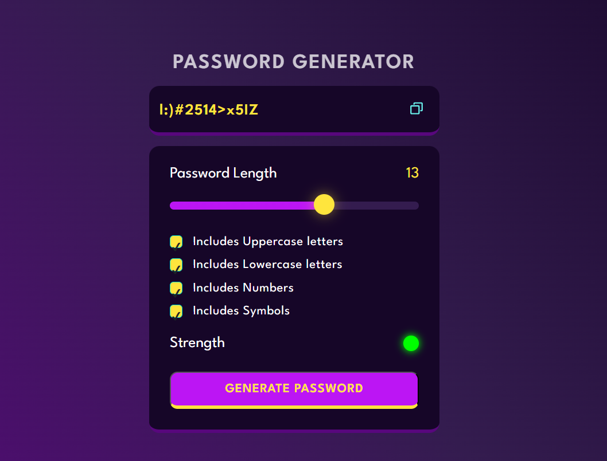

# 🔐 Password Generator

## Description

This is a simple yet powerful password generator written in JavaScript. It allows you to create secure and unique passwords with various customization options.

## Features

- **Password Length:** Choose the length of your password.
- **Character Types:** Include or exclude uppercase letters, lowercase letters, numbers, and special characters.
- **Secure Randomization:** Uses a strong randomization algorithm to ensure the security of generated passwords.

## How to Use

1. Open the 🌐 `index.html` file in your preferred web browser.
2. Set the desired options for your password.
3. Click the "Generate Password" 🔄 button.
4. Your secure password will be displayed in the designated area.
5. Click "Copy to Clipboard" 📋 to easily use the generated password.

## Screenshots

## Technologies Used

- HTML 🖥️
- CSS 🎨
- JavaScript 🚀

## Contributing

Feel free to contribute to the project. If you have any suggestions or find a bug, please open an issue or submit a pull request.

## License

This project is licensed under the **MIT License**. See the [LICENSE](LICENSE) file for details.

---
